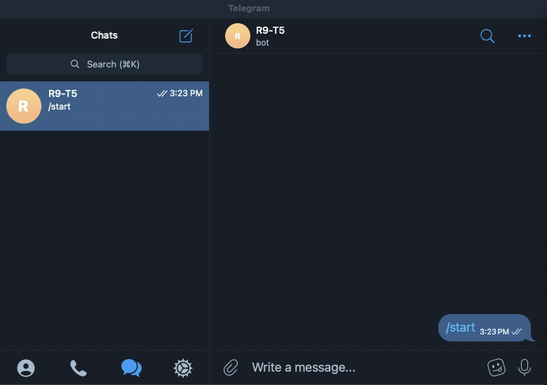

I want to be able to message a telegram bot `roll d6` and it responds with a result

# Setup
`TELOXIDE_TOKEN` must be set to the Bot Token provided by @BotFather on Telegram

if you don't have a bot set up, run `/newbot` in a chat with @BotFather to get
a token

# TODO
- [x] Read up on Telegram API
- [x] Get a bot account
- [x] bot hello world
- [x] create a service that responds to a chat and generates a random number

